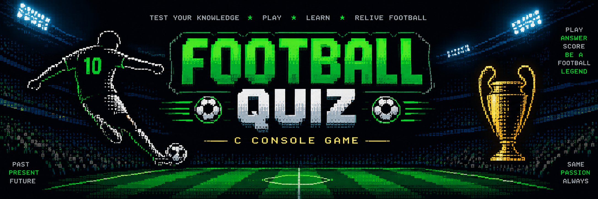
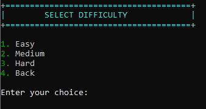
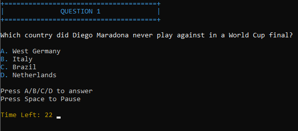
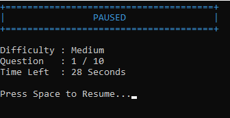
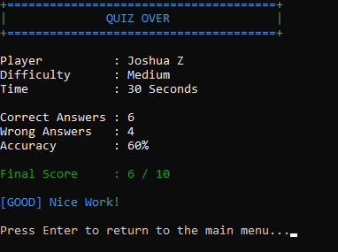
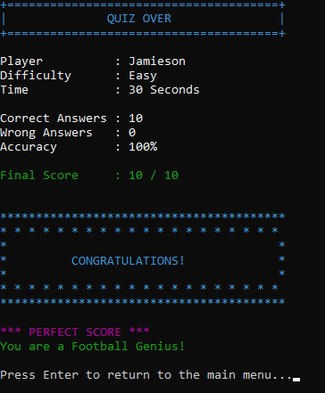

# ⚽ Football Quiz

<p align="center">
  
</p>

A feature-rich football quiz game developed in **C** for Windows. Test your football knowledge across multiple difficulty levels with timed questions, background music, sound effects, colorful console UI, and a leaderboard system.

---


# ✨ Features

- ⚽ 60 Football Questions (20 Easy, 20 Medium, 20 Hard)
- 🎯 Three Difficulty Levels
- ⏱️ Timed Quiz (15s, 30s, 45s, 60s & Custom Time)
- 🔀 Random Question Selection
- 🔄 Randomized Answer Options
- ⏸️ Pause & Resume Feature
- 🎵 Background Music
- 🎶 Alternates between two songs on every launch
- 🔊 Sound Effects for:
  - Correct Answer
  - Wrong Answer
  - Timeout
  - Menu Click
  - Pause/Resume
  - Celebrations
- 🏆 Separate Top 5 Leaderboards for Easy, Medium & Hard
- 📊 Quiz Statistics
  - Correct Answers
  - Wrong Answers
  - Accuracy
  - Final Score
- 🎉 Perfect Score Celebration
- 🌈 ANSI Colored Console Interface
- 🔨 One-click Build Script (`build.bat`)

---

# 📸 Screenshots

## Main Menu


---

## Difficulty Selection



---

## Time Selection


---

## Quiz Screen



---

## Pause Screen



---

## Leaderboard


---

## Quiz Result



---

## Perfect Score



---

# 🎮 Controls

| Key | Function |
|------|----------|
| A / B / C / D | Answer Question |
| Space | Pause / Resume Quiz |
| Enter | Continue |

---

# 🛠 Technologies Used

- Language: **C**
- Compiler: **GCC (MinGW)**
- Platform: **Windows**

### Libraries

- windows.h
- mmsystem.h
- conio.h
- stdio.h
- stdlib.h
- string.h
- time.h

---
## 📥 Downloading & Running

### Option 1 — Download ZIP (Recommended)

1. Click the green **Code** button.
2. Select **Download ZIP**.
3. Extract the downloaded ZIP file.
4. Open the extracted folder.
5. Double-click **footballquiz.exe** to start the game.

> **Important:**  
> Do not move `footballquiz.exe` outside the project folder.
> The `data` and `sounds` folders must remain in the same directory as the executable.

---

### Option 2 — Clone the Repository

If you have Git installed:

```bash
git clone https://github.com/Piyas237/Football-Quiz.git
```

Open the project folder and run:

```bash
build.bat
```

This will automatically compile the project and create:

```
footballquiz.exe
```

---

### Folder Structure

```
Football-Quiz/
│
├── footballquiz.exe
├── build.bat
├── data/
├── sounds/
├── assets/
├── include/
├── src/
└── README.md
```

# 📂 Project Structure

```
Football-Quiz/
│
├── assets/
│   ├── banner.png
│   ├── main-menu.png
│   ├── difficulty-menu.png
│   ├── time-selection.png
│   ├── question-screen.png
│   ├── pause-screen.png
│   ├── leaderboard.png
│   ├── result-screen.png
│   └── perfect-score.png
│
├── data/
│   ├── easy.txt
│   ├── medium.txt
│   ├── hard.txt
│   ├── highscores.txt
│   └── music.dat
│
├── include/
├── sounds/
├── src/
│
├── build.bat
├── footballquiz.exe
├── README.md
└── LICENSE
```

---

# 🚀 How to Build

Simply run

```
build.bat
```

The executable `footballquiz.exe` will be generated automatically.

---

# ▶️ How to Run

Double-click

```
footballquiz.exe
```

or run it from the terminal.

---

# 🏅 Quiz Flow

```
Main Menu
      ↓
Choose Difficulty
      ↓
Choose Time Limit
      ↓
Enter Player Name
      ↓
Play 10 Random Questions
      ↓
View Final Statistics
      ↓
Save High Score
      ↓
Return to Main Menu
```

---

# 📊 Quiz Statistics

After every quiz, the game displays:

- Correct Answers
- Wrong Answers
- Accuracy (%)
- Final Score
- Difficulty
- Time Limit

Players achieving a perfect **10/10** receive a special celebration with exclusive sound effects and a congratulatory message.

---

# 🔮 Future Improvements

- More football questions
- Quiz categories (World Cup, Champions League, Premier League, etc.)
- Lifelines (50:50, Skip, Hint)
- Achievement system
- Player statistics
- Quiz history
- Automatic background music looping
- Cross-platform support

---

# 👨‍💻 About

This project was developed as a first-year Computer Science project to practice:

- Modular Programming
- File Handling
- Structures
- Arrays
- Randomization
- Console UI Design
- Sound Integration using Windows Multimedia API
- ANSI Escape Sequences
- Git & GitHub

---

## Author

Piyas Sur

GitHub:
https://github.com/Piyas237


# 📜 License

This project is released under the **MIT License**.

Feel free to use, modify, and learn from it.

---

## ⭐ If you enjoyed this project, consider giving it a star on GitHub!
