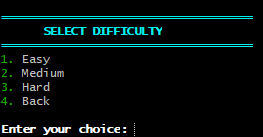

## 🚀 Installation

### Requirements

- Windows
- GCC (MinGW)

### Clone the Repository

```bash
git clone https://github.com/Piyas237/Football-Quiz.git
cd Football-Quiz
```

### Compile

```bash
gcc src/*.c -Iinclude -Wall -Wextra -o footballquiz.exe
```

### Run

```bash
footballquiz.exe
```

## 📷 Preview

### Main Menu


### Difficulty Selection



### Time Selection


### Quiz Settings


### Gameplay


### High Scores


### Quiz Over


